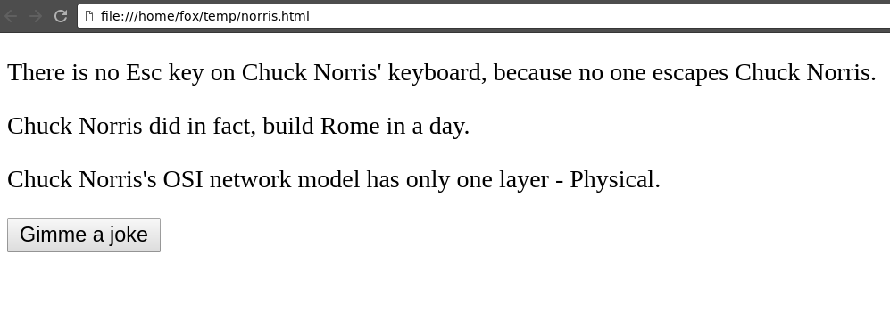

# Fetch some joke

 -  Create a web application with a `
` container and a `<button>`.
 - 	The button should start a `fetch`-based request.
     -  You can use [this](http://api.icndb.com/jokes/random) API.
     -  Store the result in your container.
     -  Handle your promise's `rejected` status also (show some error message).
     -  You can implement more awesome design than the example :smiley:

